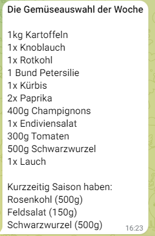

# Veggie Bot

This python Telegram Veggie Bot sends a choice of seasonal vegetaries as a telegram message, 
that can be bought on the farmers market. 
It can be operated via a cron job.

The programm has three main parts:
1. A sqlite database with 54 German vegetaries, mushrooms and herbs. Each entry has flags for each month, 
if it is in season or not. Each entry also has a category, a typical amount for two persons and a factor, that serves as a indicator for a veg 
that only has a short season (which might be preferred over others during this season)
2. A little method that randomly picks one seasonal veg per category and adds short seasoned vegs to category "special"
3. An API Call for a Telegram bot that sends a formatted list of vegs based on the choice list as a telegram message

## TODOs for usage
- create a telegram bot, and copy the API token and message_id into token.txt (change name of existing token.txt.default) 
